# StarParticleFX

用于生成、集成和优化前端星辰粒子视觉效果的 Agent Skill。覆盖网页首屏、品牌展示、滚动叙事、章节转场与交互式粒子场，并包含响应式适配、性能控制、降低动态效果和曝光治理。

项目灵感来源：阅读 [GPT‑6 Astra](https://openai.com/index/gpt-6-astra/) 文章时，被页面惊艳的背景转换效果所启发。

## 架构

```text
用户意图
  └─ SKILL.md：选择效果与执行约束
       ├─ references/effect-catalog.md：效果路由
       ├─ references/recipes/*.md：按需加载的独立配方
       ├─ references/integration.md：前端集成策略
       └─ assets/demo：无框架 Canvas 2D 演示与起点
```

## 包含的效果

| # | 效果名称 | 核心感觉 | 效果 |
|---:|---|---|---|
| 01 | 星辰汇聚成图案 | 聚合、揭示、品牌记忆 |  |
| 02 | 星辰连线 | 秩序、连接、智能 | 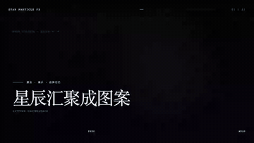 |
| 03 | 星系旋涡 | 宏大、流动、宇宙 |  |
| 04 | 黑洞坍缩 | 终结、聚焦、转场 | 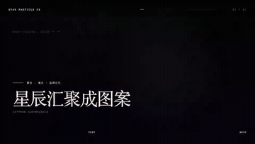 |
| 05 | 超新星爆发 | 发布、突破、高潮 | 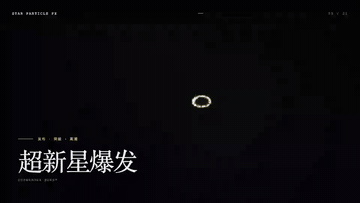 |
| 06 | 星海穿越 | 速度、探索、未来 |  |
| 07 | 引力透镜 | 科学、互动、空间感 | 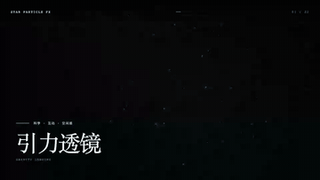 |
| 08 | 星云呼吸 | 情绪、生命感、氛围 | 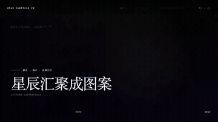 |
| 09 | 轨道系统 | 系统、生态、秩序 | 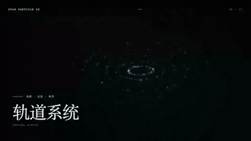 |
| 10 | 星尘降落 | 从宇宙到现实 |  |
| 11 | 星幕折叠 | 空间、维度、艺术 | 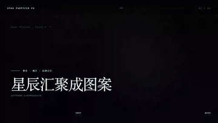 |
| 12 | 星辰分裂 | 生长、繁殖、进化 | 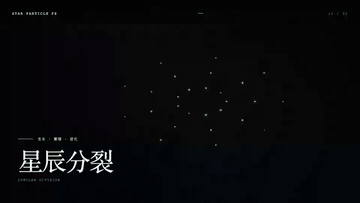 |
| 13 | 星辰冻结 | 精密、科技、静止 | 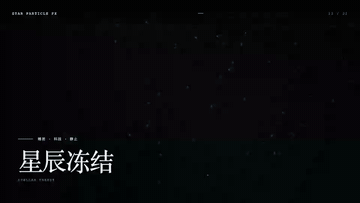 |
| 14 | 星河分流 | 路径、选择、产品矩阵 |  |
| 15 | 色彩迁移 | 情绪变化、品牌过渡 | 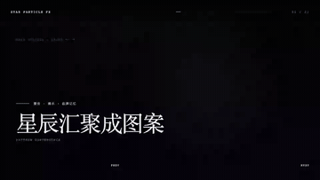 |
| 16 | 波浪传播 | 信息传播、能量 | 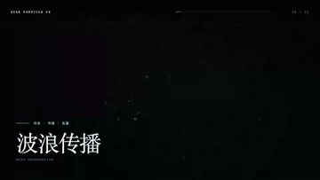 |
| 17 | 群体迁徙 | 自组织、群体智能 | 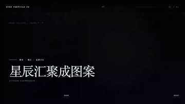 |
| 18 | 时间倒流 | 回忆、修复、重生 | 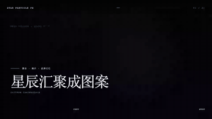 |
| 19 | 负空间显影 | 神秘、克制、高级 | 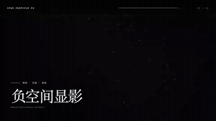 |
| 20 | 星球诞生 | 创造、世界观、起源 | 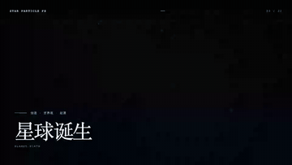 |
| 21 | 微观缩放 | 无限、递归、尺度 | 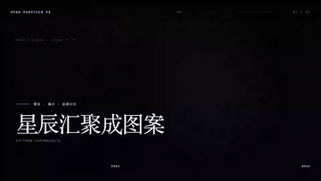 |

## 安装

```bash
curl -L https://github.com/TabTabZL/StarParticleFX/releases/latest/download/star-particle-fx.zip -o /tmp/star-particle-fx.zip
unzip -q /tmp/star-particle-fx.zip -d ~/.skills
skill-sync
```

安装包只包含 Skill 运行所需文件，不包含 README 和演示媒体。

## 使用

```text
$star-particle-fx 为首页首屏制作星辰汇聚成品牌图案的效果，保持现有 React 技术栈并支持 reduced motion。
```

Skill 会先选择最合适的效果配方，再根据现有项目决定使用 Canvas 2D、WebGL 或已有粒子库。演示页面位于 `assets/demo/index.html`，可直接通过静态服务器运行。

## 开发验证

```bash
node scripts/check-skill.mjs
python3 scripts/capture-previews.py --help
```

## License

MIT
